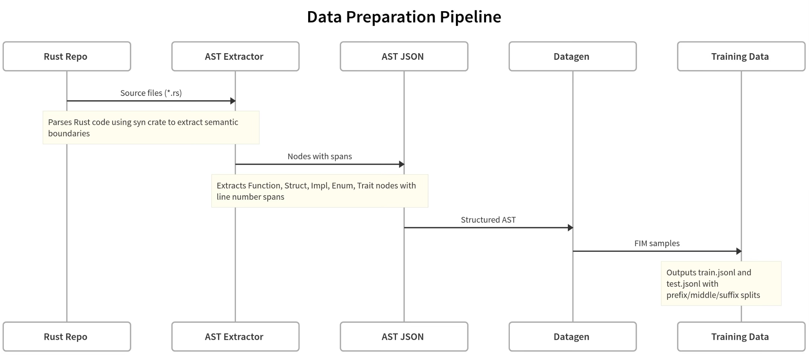
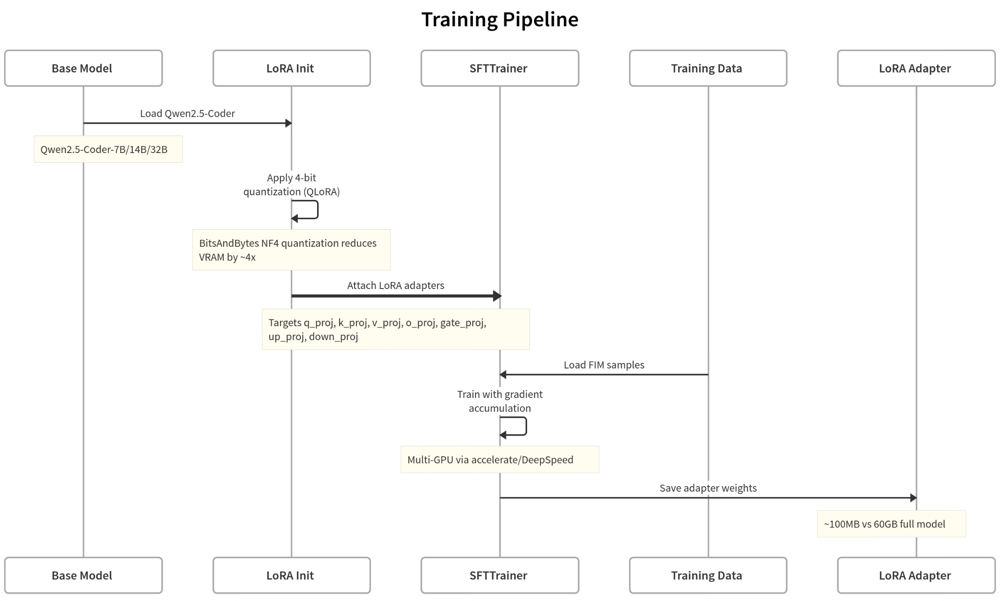
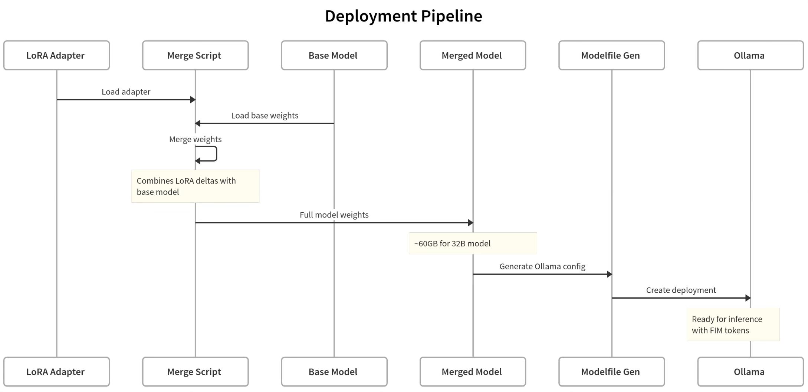
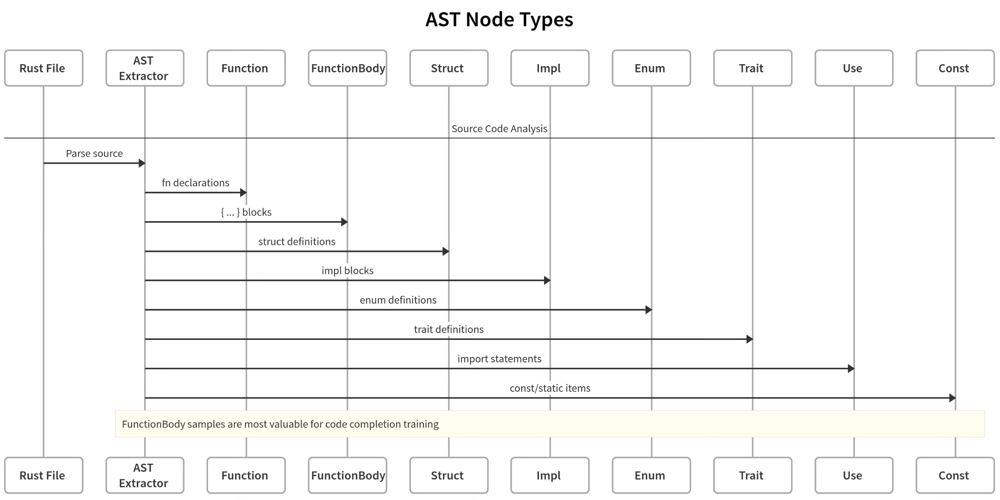

# FIM Coder Model

A training framework for fine-tuning Large Language Models on Fill-in-the-Middle (FIM) code completion tasks using AST-aware data generation.

## Overview

This framework extracts semantic code boundaries (functions, structs, impl blocks) from Rust codebases using AST parsing, generates FIM training samples, and fine-tunes models using LoRA with 4-bit quantization for efficient multi-GPU training.

## Architecture

### Data Preparation Pipeline



### Training Pipeline



### Deployment Pipeline



## FIM Sample Format

The training data follows the DeepSeek Coder FIM token format:

```
<｜fim▁begin｜>impl Handler {
    pub fn new(config: Config) -> Self {
        <｜fim▁hole｜>
    }
}
<｜fim▁end｜>Self { config, state: State::default() }<｜end▁of▁sentence｜>
```

### Node Types Extracted



## Requirements

- Python 3.9+
- CUDA-capable GPU (24GB+ VRAM recommended for the default 6.7B QLoRA run)
- Rust toolchain (for AST extractor)

## Installation

```bash
python3 -m venv env && source env/bin/activate
pip install -r requirements.txt

# Build AST extractor
cd ast_extractor && cargo build --release && cd ..
```

## Usage

### Data Preparation

```bash
# Clone target repository
git clone --depth 1 https://github.com/paradigmxyz/reth /tmp/reth

# Extract AST nodes with spans
./ast_extractor/target/release/ast_extractor /tmp/reth ./data/reth_ast.json

# Generate FIM training samples
python3 datagen/datagen.py --ast data/reth_ast.json --output_prefix reth
```

### Training

```bash
# Single GPU
python3 training/train.py

# Multi-GPU with accelerate
accelerate launch --num_processes 4 training/train.py

# Override config parameters
python3 training/train.py --epochs 5 --lr 5e-5
```

### Post-Training

```bash
# Merge LoRA adapters into base model
python3 utils/merging.py --run_dir training/runs/<run_name>

# Deploy with Ollama
ollama create <model_name> -f training/runs/<run_name>/modelfile
```

## Configuration

All training parameters are defined in `config.yaml`:

| Section | Parameters |
|---------|------------|
| `model` | Base model selection, batch sizes, gradient accumulation |
| `lora` | Rank, alpha, dropout, target modules |
| `quantization` | 4-bit quantization settings |
| `training` | Epochs, learning rate, warmup, optimizer |
| `checkpointing` | Save frequency, evaluation intervals |
| `data` | Training/test file paths, repository name |

## Project Structure

```
├── config.yaml              # Training configuration
├── requirements.txt         # Python dependencies
├── ast_extractor/           # Rust-based AST extraction
│   ├── Cargo.toml
│   └── src/main.rs
├── datagen/
│   └── datagen.py           # FIM sample generation
├── training/
│   ├── train.py             # Main training script
│   └── runs/                # Training outputs
├── inference/
│   └── infer.py             # Model evaluation
└── utils/
    ├── merging.py           # LoRA adapter merging
    └── gen_modelfile.py     # Ollama modelfile generation
```

## Supported Base Models

| Model | Parameters | VRAM (4-bit) | Recommended GPUs |
|-------|------------|--------------|------------------|
| DeepSeek-Coder-6.7B Base | 6.7B | ~8GB | 1x RTX 4090 |

## License

MIT
